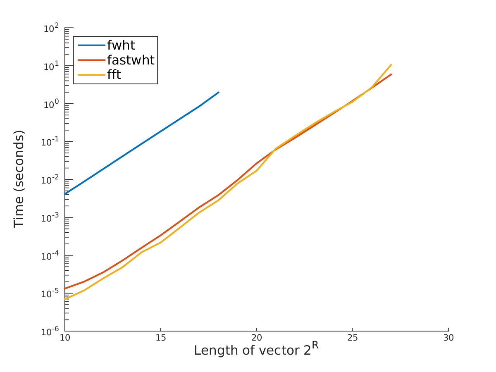

# Fastwht
## A fast Walsh-Hadamard transform for MATLAB and Python

`fastwht` is a C++ implementation (using [fxt](http://www.jjj.de/fxt/)) of the fast Walsh-Hadamard transform with bindings to MATLAB and Python. The algorithm performs the transform in place in O( N log(N) ) operations. The current version is order of magnitude faster than MATLAB's own implementation `fwht`.  As Python's Numpy and Scipy packages do not implement this transform, no such comparison has been made for the Python implementation. 

### MATLAB

The MATLAB interface supports the two functions `fastwht` and `had_mat_idx`. The `fastwht` function is a faster version of MATLAB's `fwht` function, and for its usage, we refer to MATLAB's own [documentation](http://se.mathworks.com/help/signal/ref/fwht.html).  The [`had_mat_idx` function](matlab/had_mat_idx.m) is a function generating requested entries in a 2^n x 2^n sequency ordered Hadamard matrix. This function is very convenient to use when you want to evaluate a Walsh function at a single or a few dyadic grid points. This can be done by using the relation between Walsh functions and Hadamard matrices.

Below you find a test of performance between the `fastwht` function found in this repository and MATLAB's `fwht` and `fft` functions. As you can see from the figure, the function performs on par with the `fft` function, while it is order of magnitude faster than MATLAB's own implementation. 


### Python
The interface between C++ and Python is auto-generated using [Swig](http://www.swig.org) version 3.0.8. On top of this python interface, there has been built an extra layer of wrapper code to support complex arrays and matrix objects. None of swig's auto-generated code is submitted in this repository.

## Install
You may pull the required code directly from this repository and compile it yourself, or you can download these precompiled binaries:
[MATLAB](https://www.mn.uio.no/math/english/people/aca/vegarant/fastwht_matlab.zip) and
[Python](https://www.mn.uio.no/math/english/people/aca/vegarant/fastwht_python.zip).
Remember to update your Python and MATLAB path after you have compiled the code. The current release has mostly been tested on Linux machines.

### Parallel computations
If the `fastwht` function receives a matrix input, it applies the fast Walsh-Hadamard transform to each column in the matrix. This operation can be performed in parallel. If you have access to a mex compiler (with openMP), this part of the code can be easily parallelised (in the MATLAB version) by uncommenting the lines 22, 282-284 and 289. To compile the code with openMP use the mex compiler with the following flags. 
```
# From within the matlab subdirectory
mex CFLAGS='-O2 -fPIC -fopenmp' LDFLAGS='-fopenmp'  fastwht.cpp ../hadamard.cpp
``` 

## License
The project is published under GNU General Public License version 3.

## Contact
For any questions concerning the code, please contact Vegard Antun at vegarant@math.uio.no
